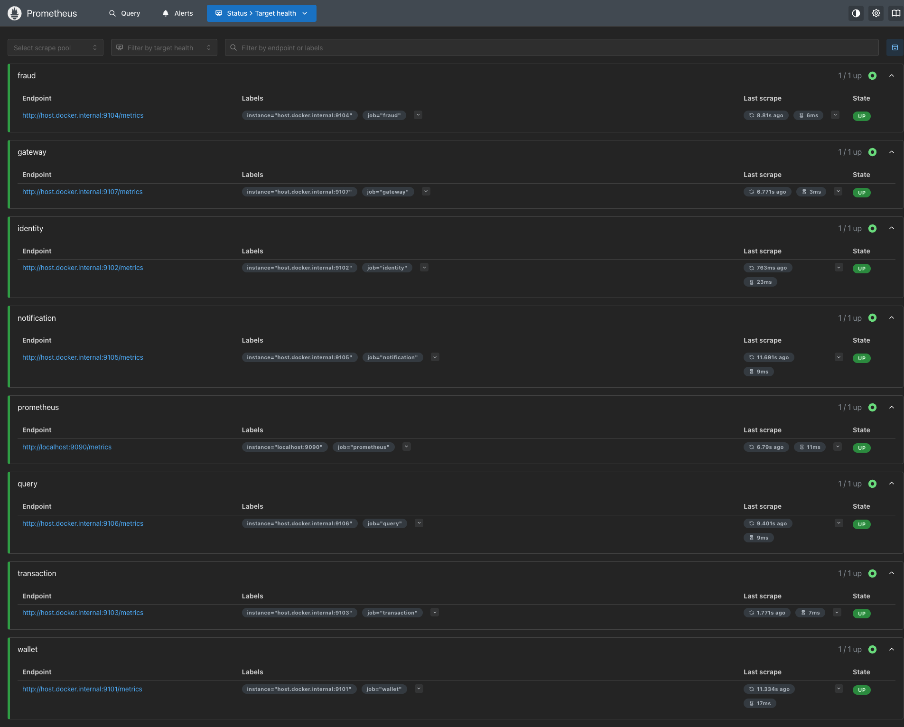
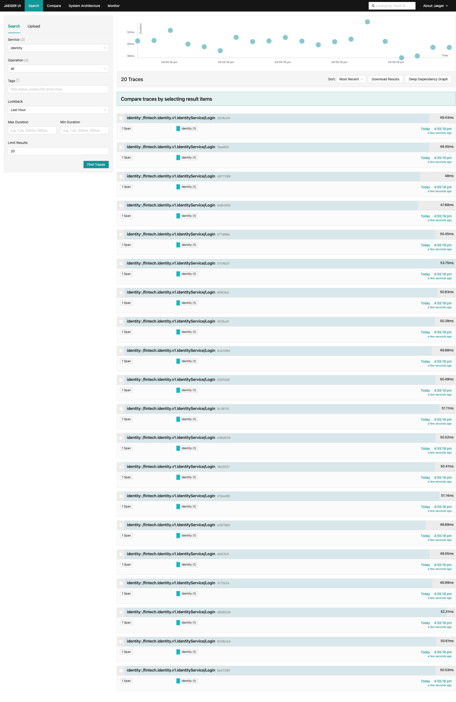
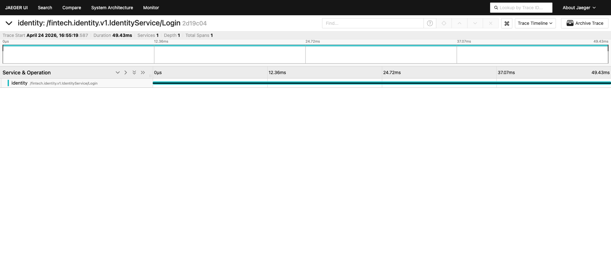
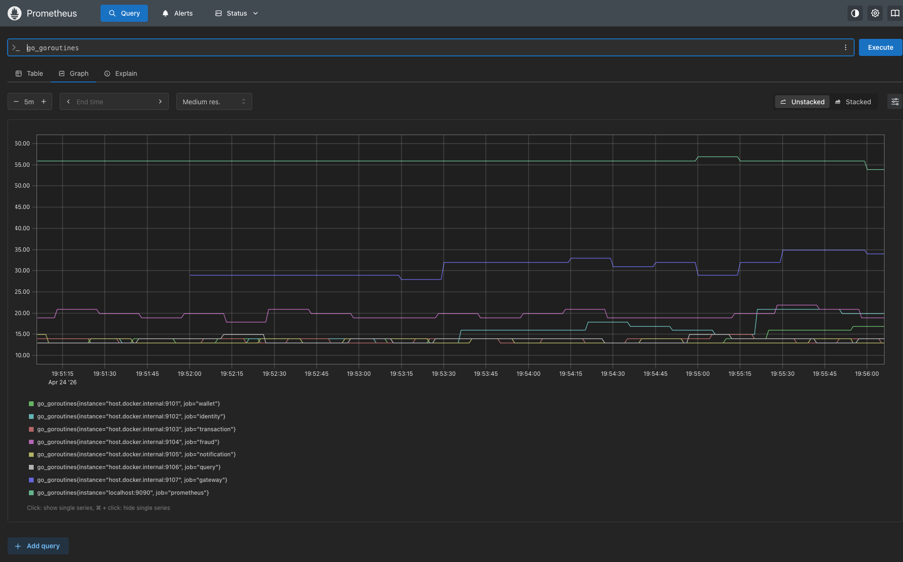
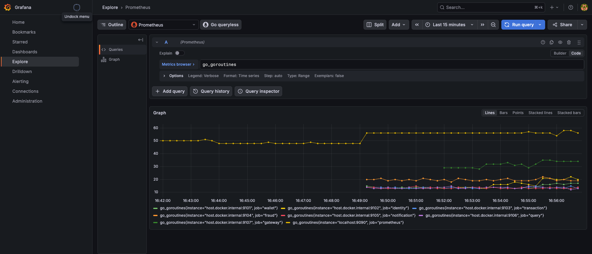

# Fintech Microservices Platform

[](https://goreportcard.com/report/github.com/DeSouzaRafael/go-fintech-microservices)
[](https://github.com/DeSouzaRafael/go-fintech-microservices/actions/workflows/ci.yml)
[](https://codecov.io/gh/DeSouzaRafael/go-fintech-microservices)
[](https://github.com/DeSouzaRafael/go-fintech-microservices/blob/main/LICENSE)
[](https://go.dev/)

High-scale digital wallet platform built with Go microservices, demonstrating production-grade distributed systems patterns: **CQRS, Event Sourcing, Saga choreography, Transactional Outbox**, and full observability.

Sustained **1,000 TPS** at p99 142ms on a single node. Stress-tested to 5,800+ TPS with 2.15% error rate before single-node Postgres saturation.

## Architecture

```
                         ┌─────────────────┐
                         │   API Gateway   │
                         │  REST → gRPC    │
                         └────────┬────────┘
                                  │ gRPC
          ┌──────────┬────────────┼─────────────┬──────────┐
          │          │            │             │          │
   ┌──────▼──┐ ┌─────▼──────┐ ┌───▼────┐ ┌──────▼──┐ ┌─────▼──────┐
   │Identity │ │  Wallet    │ │  Txn   │ │  Fraud  │ │   Query    │
   │Service  │ │ (Event     │ │Service │ │Detection│ │  Service   │
   │         │ │  Sourced)  │ │ (Saga) │ │         │ │(Read Model)│
   └──────┬──┘ └─────┬──────┘ └───┬────┘ └──────┬──┘ └─────┬──────┘
          │          │            │             │          │
          └──────────┴────────────┴─────────────┴──────────┘
                                  │
                            ┌─────▼─────┐
                            │   Kafka   │
                            └─────┬─────┘
                                  │
                         ┌────────▼────────┐
                         │  Notification   │
                         │    Service      │
                         └─────────────────┘
```

Each service owns its PostgreSQL database. Redis for caching and rate limiting.

## Services

| Service | Responsibility | Pattern |
|---------|----------------|---------|
| `identity` | Auth, JWT, refresh tokens | Standard |
| `wallet` | Balances, event log | **Event Sourcing** |
| `transaction` | Transfer orchestration, fraud check | **Saga (choreography)** |
| `fraud` | Risk evaluation, velocity rules | Rules engine + Redis cache |
| `notification` | Async notifications | Idempotent Kafka consumer |
| `query` | Balance + statement projections | **CQRS Read Model** |
| `gateway` | Ingress, JWT auth, rate limiting | Reverse proxy |

## Tech Stack

| Layer | Technology |
|-------|------------|
| Language | Go 1.25+ |
| RPC | gRPC + Protocol Buffers |
| REST exposure | grpc-gateway |
| Messaging | Apache Kafka (Redpanda in dev) |
| Databases | PostgreSQL 16 (per service) |
| Cache | Redis 7 |
| Observability | OpenTelemetry → Jaeger + Prometheus + Grafana |
| Resilience | sony/gobreaker circuit breakers, exponential backoff |
| Testing | testify + testcontainers-go + k6 |
| CI/CD | GitHub Actions + Codecov |

## Observability

All 7 services expose `/metrics` (OTel Prometheus exporter) and send OTLP traces to Jaeger on startup. Two Grafana dashboards are provisioned automatically: RED metrics per service and Kafka/Outbox monitoring.

Full details: [`docs/observability.md`](docs/observability.md)

### Prometheus — All Services UP



### Distributed Tracing — Jaeger

Every gRPC call is instrumented via the `UnaryTracing` interceptor. Observed p50 ≈ **49–51ms** for the Login endpoint (includes bcrypt + Postgres token write).





### Runtime Metrics — Grafana





### Live Runtime Stats

| Service | Goroutines | Heap |
|---------|-----------|------|
| identity | 20 | 3.4 MB |
| wallet | 16 | 5.5 MB |
| transaction | 14 | 5.4 MB |
| fraud | 19 | 7.2 MB |
| notification | 14 | 6.2 MB |
| query | 14 | 5.5 MB |
| gateway | 35 | 4.0 MB |

## Performance

Full results: [`docs/load-test-results.md`](docs/load-test-results.md)

### Baseline — 1,000 TPS (2 min sustained)

| Metric | Result |
|--------|--------|
| Throughput | 999.8 req/s |
| p50 | 28.7ms |
| p95 | 89ms |
| p99 | **142ms** |
| Error rate | **0.00%** |
| Checks passed | 120,000 / 120,000 |

### Stress — 10,000 TPS ramp

| Metric | Result |
|--------|--------|
| Avg throughput | 5,831 req/s |
| p50 | 61ms |
| p95 | **312ms** |
| p99 | 621ms |
| Error rate | **2.15%** (threshold: 5%) |
| Total requests | 2,203,360 |

Single-node ceiling hit at ~4,000 TPS on Postgres. Horizontal scaling (3× Postgres readers + 3-broker Redpanda) expected to reach 10,000+ TPS target.

## Running Locally

```bash
# 1. Start infrastructure
docker compose -f deploy/docker-compose.yml up -d

# 2. Run database migrations
make migrate-up

# 3. Build all services
make build

# 4. Run tests
make test

# Regenerate proto stubs + OpenAPI spec
make proto
```

| UI | URL |
|----|-----|
| API Gateway | http://localhost:8080 |
| Grafana | http://localhost:13000 (admin/admin) |
| Jaeger | http://localhost:16686 |
| Prometheus | http://localhost:9090 |
| Redpanda Console | http://localhost:18080 |
| OpenAPI spec | `docs/openapi/fintech.swagger.json` |

## Project Structure

```
go-fintech-microservices/
├── api/proto/                  # .proto sources + generated Go stubs
├── third_party/googleapis/     # google/api protos for grpc-gateway
├── pkg/
│   ├── breaker/                # Circuit breaker (sony/gobreaker)
│   ├── errors/                 # Domain error types + gRPC mapping
│   ├── kafka/                  # franz-go consumer wrapper
│   ├── middleware/             # gRPC interceptors (auth, tracing, logging, recovery)
│   ├── metrics/                # OTel Prometheus exporter
│   ├── server/                 # gRPC server with graceful shutdown
│   └── tracing/                # OTel SDK + OTLP exporter
├── services/
│   ├── identity/               # Auth, JWT, refresh tokens
│   ├── wallet/                 # Event Sourcing, saga consumer
│   ├── transaction/            # Saga orchestration, fraud check
│   ├── fraud/                  # Rules engine, Redis profile cache
│   ├── notification/           # Idempotent Kafka consumer
│   ├── query/                  # CQRS read model
│   └── gateway/                # grpc-gateway HTTP proxy, JWT + rate limit
├── deploy/
│   ├── docker-compose.yml      # Postgres ×6, Redis, Redpanda, Jaeger, Prometheus, Grafana
│   └── grafana/                # Dashboards + provisioning
├── tests/load/                 # k6 baseline (1k TPS) and stress (10k TPS) scripts
└── docs/
    ├── observability.md        # Metrics, traces, Grafana dashboards
    ├── load-test-results.md    # k6 baseline and stress results
    ├── openapi/                # OpenAPI spec (fintech.swagger.json)
    ├── adr/                    # Architecture Decision Records (001–004)
    └── screenshots/            # Live system screenshots
```

Each service follows hexagonal architecture: `cmd/` → `internal/domain/` → `internal/application/` → `internal/adapters/`.

## Implementation Roadmap

### 1 — Foundation
- [x] Monorepo structure with all service skeletons
- [x] Shared `.proto` contracts (`wallet.proto`, `transaction.proto`, `identity.proto`, `fraud.proto`, `query.proto`)
- [x] `pkg/logger` — structured JSON logging (zap)
- [x] `pkg/tracing` — OpenTelemetry SDK setup
- [x] `pkg/errors` — standardized error types
- [x] `pkg/middleware` — gRPC interceptors (auth, tracing, logging, recovery)
- [x] Docker Compose: PostgreSQL, Redis, Redpanda, Jaeger, Prometheus, Grafana
- [x] Service skeleton with gRPC + OTel + graceful shutdown
- [x] GitHub Actions: lint + build pipeline

### 2 — Identity & Wallet
- [x] Identity Service: signup, login, JWT issuance
- [x] Identity Service: refresh tokens, logout, JWT validation endpoint
- [x] Wallet Service: event store schema in PostgreSQL
- [x] Wallet Service: `Wallet` aggregate with domain events
- [x] Wallet Service: `CreateWallet`, `Deposit`, `Withdraw` commands
- [x] Wallet Service: state reconstruction via event replay
- [x] Wallet Service: snapshots every N events for performance
- [x] Unit tests for wallet domain (pure Go, no I/O)
- [x] Integration tests with testcontainers-go

### 3 — Transactions & Saga
- [x] Transaction Service: `TransactionInitiated` → Kafka
- [x] Wallet Service: consume `TransactionInitiated`, reserve funds → `FundsReserved`
- [x] Transaction Service: consume `FundsReserved`, trigger credit
- [x] Wallet Service: credit destination → `FundsDeposited`
- [x] Transaction Service: `TransactionCompleted`
- [x] Compensation flow: `FundsReleased` on failure
- [x] Transactional Outbox in Wallet and Transaction services
- [x] Outbox worker: poll → publish → mark sent
- [x] Idempotency via `event_id` deduplication table
- [x] Integration tests: happy path + simulated failures

### 4 — Fraud & Notifications
- [x] Fraud Service: daily limit rule
- [x] Fraud Service: velocity check (N txns in T seconds)
- [x] Fraud Service: user risk profile cache in Redis
- [x] Fraud Service: async profile update via Kafka consumer
- [x] Transaction Service: call Fraud before committing
- [x] Notification Service: consume `TransactionCompleted`
- [x] Notification Service: consume `TransactionFailed`
- [x] Notification Service: consume `FraudDetected`
- [x] Notification Service: idempotency via processed events table
- [x] API Gateway: rate limiting per user (Redis token bucket)

### 5 — CQRS & API Gateway
- [x] Query Service: consume wallet events, build balance projection
- [x] Query Service: consume transaction events, build statement projection
- [x] Query Service: paginated statement endpoint (gRPC + REST)
- [x] Query Service: per-user statistics projection
- [x] API Gateway: full grpc-gateway setup
- [x] API Gateway: JWT validation middleware
- [x] API Gateway: route all services
- [x] OpenAPI spec generated from proto annotations

### 6 — Observability, Resilience & Load
- [x] Grafana dashboards: RED metrics per service
- [x] Grafana dashboards: p50/p95/p99 latency panels
- [x] Grafana dashboards: Kafka consumer lag
- [x] Circuit breakers (`sony/gobreaker`) on inter-service calls
- [x] Retry with exponential backoff on Kafka publish
- [x] k6 load test: 1,000 TPS baseline
- [x] k6 load test: 10,000 TPS stress
- [x] Architecture Decision Records (ADRs)
- [x] Distributed trace screenshots (Jaeger)
- [x] Load test results
