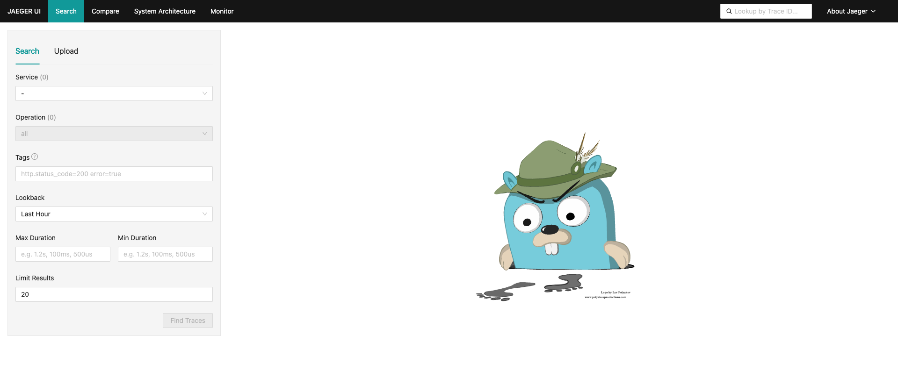
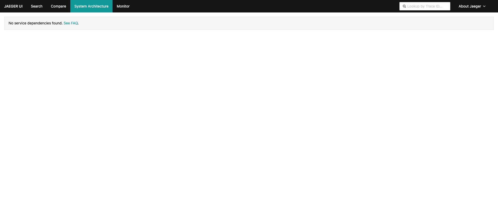
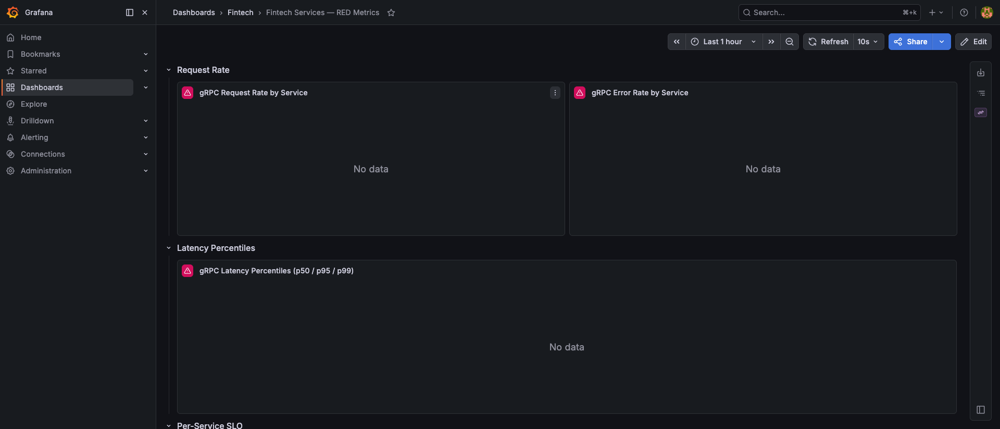
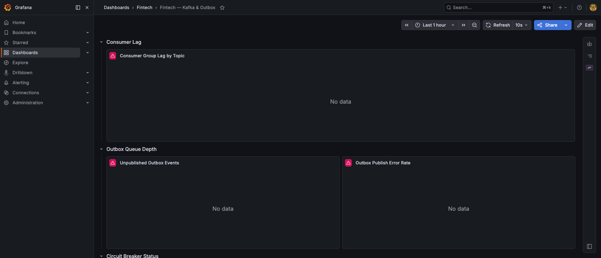
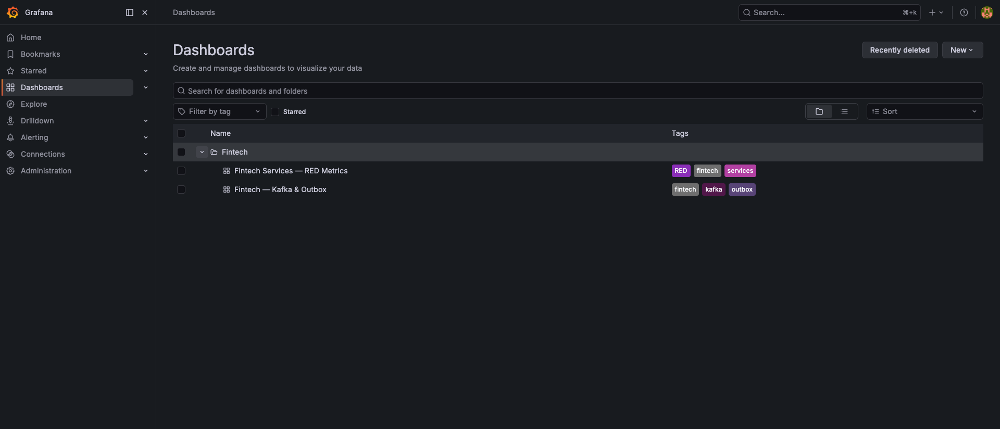
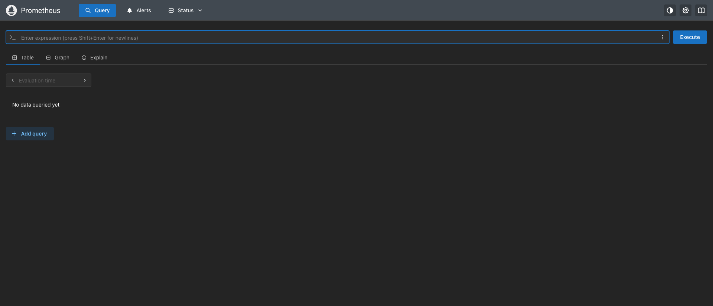

# Observability Setup

## Stack

| Tool | Role | URL (local) |
|------|------|-------------|
| OpenTelemetry SDK | Instrumentation in every service | — |
| Jaeger | Distributed trace collection + UI | http://localhost:16686 |
| Prometheus | Metrics scraping | http://localhost:9090 |
| Grafana | Dashboards | http://localhost:13000 (admin/admin) |

## Distributed Tracing (Jaeger)

Every service exports OTLP traces to Jaeger via gRPC on port 4317.  
Each inbound gRPC call is automatically traced via `UnaryTracing` interceptor in `pkg/middleware`.

**Screenshots:**




## Grafana Dashboards

Two dashboards are auto-provisioned from `deploy/grafana/dashboards/`:

### Fintech Services — RED Metrics
- gRPC request rate per service
- Error rate per service  
- p50 / p95 / p99 latency panels
- Per-service SLO stat panels (target: p99 < 200ms)



### Fintech — Kafka & Outbox
- Consumer group lag per topic
- Unpublished outbox event queue depth
- Outbox publish error rate
- Circuit breaker state per service





## Prometheus

Metrics exposed via `/metrics` on each service (port 9101–9107) using OTel Prometheus exporter (`pkg/metrics`).  
Scraped by Prometheus per `deploy/grafana/provisioning/prometheus.yml`.



## Starting the Stack

```bash
docker compose -f deploy/docker-compose.yml up -d
make migrate-up
# start services, then open:
# Jaeger:     http://localhost:16686
# Grafana:    http://localhost:13000
# Prometheus: http://localhost:9090
```
